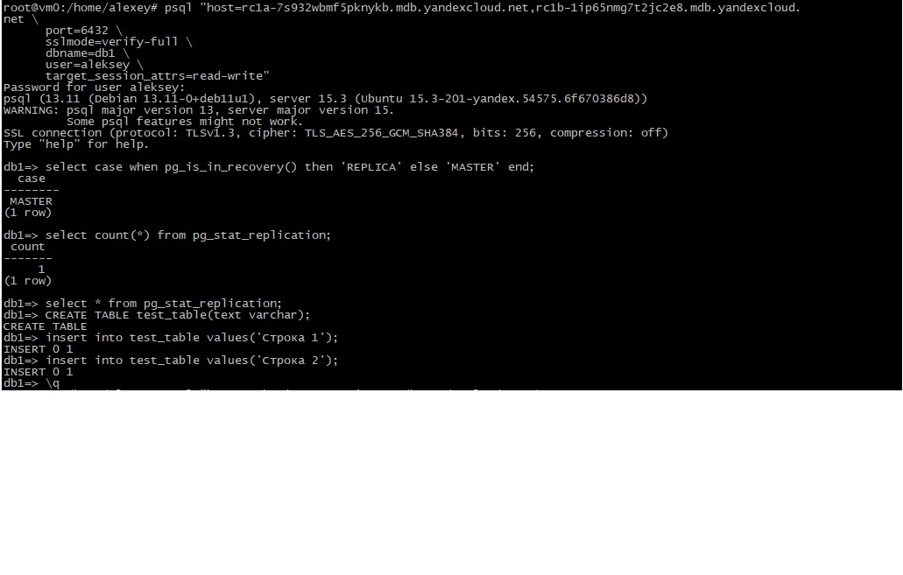
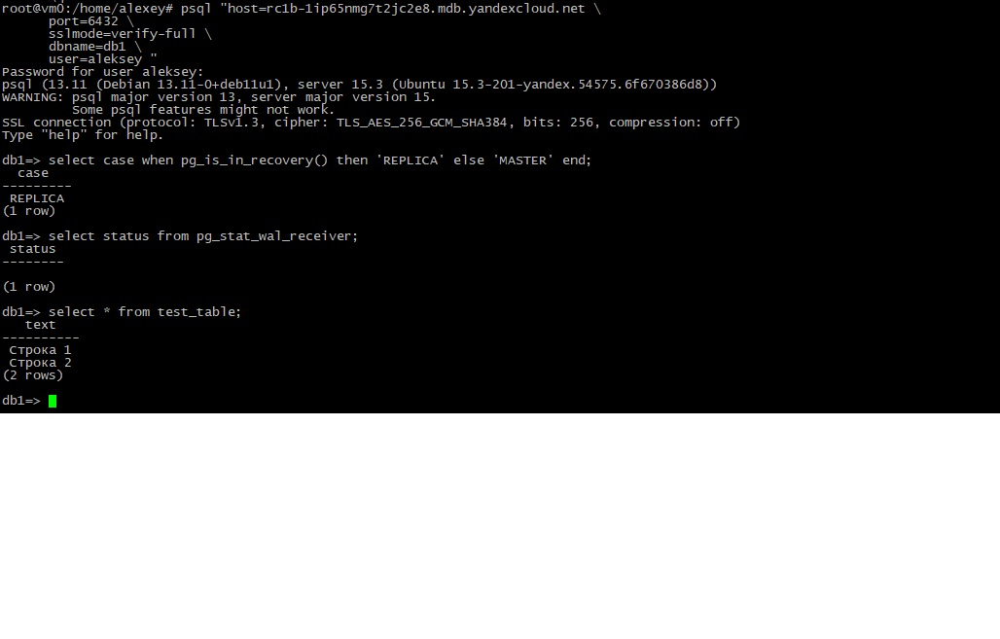
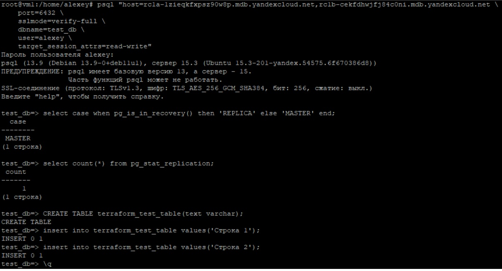
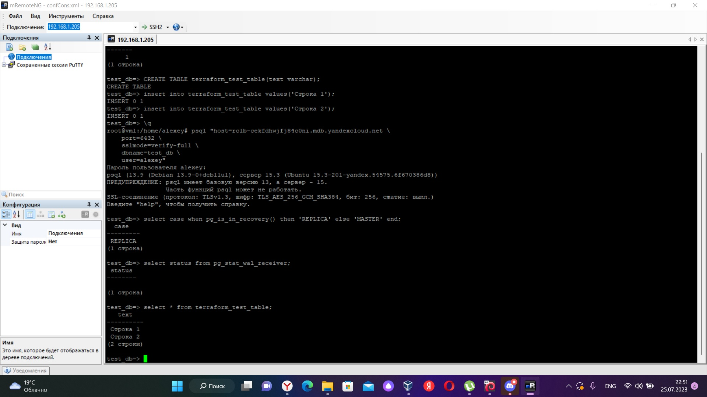

# Домашнее задание к занятию "`«Базы данных в облаке»`" - `Дьяконов Алексей`

### Задание 1. Создание кластера

1. `Мастер`
-`

2. `Реплика`
-`


### Задание 2. Создание кластера в Terraform
1. `main.tf :`

```
    // Описание  провайдера (яндекс):

    terraform {
    required_providers {
        yandex = {
        source = "yandex-cloud/yandex"
        }
    }
    }

    // подключение к облаку:
    provider "yandex" {
    token     = "token"
    cloud_id  = "cloud_id"
    folder_id = "folder_id"
    #zone      = "ru-central1-a"
    }

    resource "yandex_mdb_postgresql_cluster" "alexpostgres" {
    name                = "alexpostgres"
    environment         = "PRESTABLE"
    network_id          = yandex_vpc_network.test.id
    security_group_ids  = [ yandex_vpc_security_group.pgsql-sg.id ]
    deletion_protection = false

    config {
        version = 15
        resources {
        resource_preset_id = "s2.micro"
        disk_type_id       = "network-ssd"
        disk_size          = 10
        }
        #pooler_config {
        # pool_discard = <параметр Odyssey pool_discard: true или false>
        #pooling_mode = "<режим работы: SESSION, TRANSACTION или STATEMENT>"
        #}
        
    }

    host {
        zone      = "ru-central1-a"
        name      = "a-host"
        subnet_id = yandex_vpc_subnet.test-a.id
        assign_public_ip = true
    }
    host {
        zone      = "ru-central1-b"
        name      = "b-host"
        subnet_id = yandex_vpc_subnet.test-b.id
        assign_public_ip = true
    }
    }

    resource "yandex_mdb_postgresql_database" "test_db" {
    cluster_id = yandex_mdb_postgresql_cluster.alexpostgres.id
    name       = "test_db"
    owner      = "alexey"
    depends_on = [
    yandex_mdb_postgresql_user.alexey
    ]
    }
    resource "yandex_vpc_security_group" "pgsql-sg" {
    name       = "pgsql-sg"
    network_id = yandex_vpc_network.test.id

    ingress {
        description    = "PostgreSQL"
        port           = 6432
        protocol       = "TCP"
        v4_cidr_blocks = [ "0.0.0.0/0" ]
    }
    }

    resource "yandex_mdb_postgresql_user" "alexey" {
    cluster_id = yandex_mdb_postgresql_cluster.alexpostgres.id
    name       = "alexey"
    password   = "12345678"
    }

    resource "yandex_vpc_network" "test" { name = "test" }

    resource "yandex_vpc_subnet" "test-a" {
    name           = "test-a"
    zone           = "ru-central1-a"
    network_id     = yandex_vpc_network.test.id
    v4_cidr_blocks = [ "10.1.0.0/24" ]
    }

    resource "yandex_vpc_subnet" "test-b" {
    name           = "test-b"
    zone           = "ru-central1-b"
    network_id     = yandex_vpc_network.test.id
    v4_cidr_blocks = [ "10.2.0.0/24" ]
    }
```
2. `Мастер`
-`

3. `Реплика`
-`